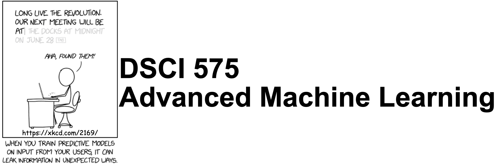

## Important links 

- [Panopto videos](https://ubc.ca.panopto.com/Panopto/Pages/Sessions/List.aspx#folderID=%22d02a3fbd-0ac0-4212-bc51-afce01047111%22)
- [Course Jupyter book](https://pages.github.ubc.ca/mds-2022-23/DSCI_575_adv-mach-learn_students/README.html)
- [Course GitHub page](https://github.ubc.ca/MDS-2022-23/DSCI_575_adv-mach-learn_students)
- [Slack Channel](https://ubc-mds.slack.com/messages/575_adv-mach-learn)
- [Canvas](https://canvas.ubc.ca/courses/106530)
- [Gradescope](https://www.gradescope.ca/courses/10058)
- [YouTube videos](https://www.youtube.com/playlist?list=PLHofvQE1VlGtZoAULxcHb7lOsMved0CuM)
- [Class + office hours calendar](https://ubc-mds.github.io/calendar/)

## Course learning outcomes    
In this course, we will learn some advanced machine learning methods in the context of natural language processing (NLP) applications. Markov chains, hidden Markov models, topic modeling, recurrent neural networks.

- Carry out basic text preprocessing.  
- Specify Markov chains and carry out generation and inference with them. 
- Explain the general idea of stationary distribution in Markov chains.
- Explain what are hidden Markov models and carry out inference and decoding with them. 
- Broadly explain Latent Dirichlet Allocation (LDA) approach to topic modeling and carry out topic modeling on text data. 
- Broadly explain Recurrent Neural Networks (RNNs) and different types of RNNs. 
- Broadly explain the idea of self-attention and transformers


## Deliverables

<details>
  <summary>Click to expand!</summary>
    
The following deliverables will determine your course grade:

| Assessment       | Weight  | Where to submit|
| :---:            | :---:   |:---:  | 
| Lab Assignment 1 | 15%     | [Gradescope](https://www.gradescope.ca/courses/10058) |
| Lab Assignment 2 | 15%     | [Gradescope](https://www.gradescope.ca/courses/10058) |
| Lab Assignment 3 | 15%     | [Gradescope](https://www.gradescope.ca/courses/10058) |
| Lab Assignment 4 | 15%     | [Gradescope](https://www.gradescope.ca/courses/10058) |
| Quiz 1           | 20%     | [Canvas](https://canvas.ubc.ca/courses/106530)     |
| Quiz 2           | 20%     | [Canvas](https://canvas.ubc.ca/courses/106530)     |

See [Calendar](https://ubc-mds.github.io/calendar/) for the due dates. 
</details>

## Teaching team
<details>
  <summary>Click to expand!</summary>
    
    
| Role | Name  | Slack Handle |
| :------: | :---: | :----------: |
| Lecture instructor | Varada Kolhatkar | `@varada` |
| Lab instructor | Varada Kolhatkar | `@varada` |
| Teaching assistant | Farnoosh Hashemi  |   | 
| Teaching assistant | Harsh Sharma  |   |     
| Teaching assistant | Mohit Pandey |   |    
| Teaching assistant | Ngoc Bui  |   |
| Teaching assistant | Shanny Lu |   |    
    
</details>  


## Lecture schedule

This course will be run in person. We will meet three times every week: twice for lectures and once for the lab. You can refer to the [Calendar](https://ubc-mds.github.io/calendar/) for lecture and lab times and locations. Lectures of this course will be a combination traditional live lecturing, class activities, and a pre-recorded videos. Drafts of the lecture notes for each week will be made available earlier in the week.  

This course occurs during **Block 6** in the 2022/23 school year.

| Lecture  | Topic  | Assigned videos/Readings | Resources and optional readings |
|-------|------------|-----------|-----------|
|   0   | [Course Information](lectures/00_course-information.ipynb) | 📹  <li> Videos: [16.1](https://youtu.be/GTC_iLPCjdY) | |
|   1   | [Markov Models](lectures/01_Markov-models.ipynb) | | <li> [Markov chains in action](http://setosa.io/ev/markov-chains/) </li> | 
|   2   | [Language models, PageRank, text preprocessing](lectures/02_LMs-text-preprocessing.ipynb) | 📹  <li> Videos: [16.2](https://youtu.be/7W5Q8gzNPBc) | <li>[OpenAI GPT3 demo](https://www.youtube.com/embed/fZSFNUT6iY8)</li><li> [Dan Jurafsky's videos on PageRank](https://www.youtube.com/playlist?list=PLaZQkZp6WhWzSy3WKExE7656jBxfXJh3I)</li> <li>[Dan Jurafsky's video on tokenization](https://www.youtube.com/watch?v=pEwBjcYdcKw)</li>|
|   3  | [Hidden Markov models](lectures/03_HMMs-intro.ipynb) |  |<li>[Nando de Freitas' lecture on HMMs](https://www.youtube.com/watch?v=jY2E6ExLxaw)</li> <li>[A gentle intro to HMMs by Eric Fosler-Lussier](http://di.ubi.pt/~jpaulo/competence/tutorials/hmm-tutorial-1.pdf)</li>|
|   4  | [HMMs decoding and inference](lectures/04_Viterbi-Baum-Welch.ipynb)) | (optional) [HMM Baum-Welch](https://youtu.be/_m5KuZGOOVI) (unlisted) | <li>[Nando de Freitas' lecture on HMMs](https://www.youtube.com/watch?v=jY2E6ExLxaw)</li> <li>[A gentle intro to HMMs by Eric Fosler-Lussier](http://di.ubi.pt/~jpaulo/competence/tutorials/hmm-tutorial-1.pdf)</li>|
|   5   | [Topic modeling](lectures/05_topic-modeling.ipynb) | | <li>Dave Blei [video lecture](https://www.youtube.com/watch?v=DDq3OVp9dNA&t=98s), [paper](http://menome.com/wp/wp-content/uploads/2014/12/Blei2011.pdf)</li> |
|   6   | [Introduction to Recurrent Neural Networks (RNNs)](lectures/06_intro-to-RNNs.ipynb) |  | <li>[The Unreasonable Effectiveness of Recurrent Neural  Networks](http://karpathy.github.io/2015/05/21/rnn-effectiveness/)</li><li>Highly recommended: [Sequence Processing with Recurrent Networks](https://web.stanford.edu/~jurafsky/slp3/9.pdf)</li>|  
|   7   | [Introduction to Transformers](lectures/07_intro-to-transformers.ipynb) |  | |
|   8   | [Applications of Transformers](lectures/08_transformers-applications.ipynb) |  | |


The labs are going to be in person. We will also be holding a short 1-hour parallel Zoom session for each lab run by the TAs so that people who cannot join in person have an opportunity to ask questions and get help. You will be able to access appropriate Zoom links via [Canvas](https://canvas.ubc.ca/courses/106530). There will be a lot of opportunity for discussion and getting help during lab sessions. Please make good use of this time.  

## Installation
 
We are providing you with a `conda` environment file which is available [here](env-dsci-575.yml). You can download this file and create a conda environment for the course and activate it as follows. 

```
conda env create -f env-dsci-575.yml
conda activate 575
```
In order to use this environment in `Jupyter`, you will have to install `nb_conda_kernels` in the environment where you have installed `Jupyter` (typically the `base` environment). You will then be able to select this new environment in `Jupyter`. For more details on this, refer to "Making environments work well with JupyterLab section" in your [521 lecture 6](https://pages.github.ubc.ca/fdandrea/521_lecture6/slides.html#51).

I've only tried installing this environment file on a couple of machines, and it's possible that you will encounter problems with some of the packages from the `yml` file when you run the commands above. This is not unusual. It often means that the package with the given version is not available for your operating system via `conda` yet. There are a couple of options for you when this happens:
1. Get rid of the line with that package from the `yml` file.
2. Create the environment without that package. 
3. Activate the environment and install the package manually either with `conda install` or `pip install` in the environment.   

_Note that this is not a complete list of the packages we'll be using in the course and there might be a few packages you will be installing using `conda install` later in the course. But this is a good enough list to get you started._ 


## Course communication
<details>
  <summary>Click to expand!</summary>

We all are here to help you learn and succeed in the course and the program. Here is how we'll be communicating with each other during the course. 

### Clarifications on the lecture notes or lab questions

If there is any clarification on the lecture material or lab questions, I'll post a message on the course Slack channel and tag you. **It is your responsibility to read the messages whenever you are tagged.** (I know that there are too many things for you to keep track of. You do not have to read all the messages but please make sure to carefully read the messages whenever you are tagged.) 

### Questions on lecture material or labs

If you have questions about the lecture material or lab questions please post them on the course Slack channel rather than direct messaging me or the TAs. Here are the advantages of doing so: 
- You'll get a quicker response. 
- Your classmates will benefit from the discussion. 

When you ask your question on the course channel, please avoid tagging the instructor unless it's specific for the instructor (e.g., if you notice some mistake in the lecture notes). If you tag a specific person, other teaching team members or your colleagues are discouraged to respond. This will decrease the response rate on the channel. 

Please use some consistent convention when you ask questions on Slack to facilitate easy search for others or future you. For example, if you want to ask a question on Exercise 3.2 from Lab 1, start your post with the label `lab1-ex2.3`. Or if you have a question on lecture 2 material, start your post with the label `lecture2`. Once the question is answered/solved, you can add "(solved)" tag before the label (e.g., (solved) `lab1-ex2.3`). Do not delete your post even if you figure out the answer on your own. The question and the discussion can still be beneficial to others.  

### Questions related to grading

For each deliverable, after I return grades, I'll let you know who has graded what in our course Slack by opening an issue in the course GitHub repository. If you have questions related to grading
- First, make sure your concerns are reasonable (read the ["Reasonable grading concerns" policy](https://ubc-mds.github.io/policies/)). 
- If you believe that your request is reasonable, open a regrade request on Gradescope. 
- If you are unable to resolve the issue with the TA, send a Slack message to the instructor, including the appropriate TA in the conversation. 

### Questions related to your personal situation or talking about sensitive information
 
I am open for a conversation with you. If you want to talk about anything sensitive, please direct message me on Slack (and tag me) rather than posting it on the course channel. It might take a while for me to get back to you, but I'll try my best to respond as soon as possible. 

</details>

## Working during the COVID-19 global pandemic
<details>
  <summary>Click to expand!</summary>
    
We are working together on this course during this transition period between hybrid to in-person teaching and learning. Everyone is struggling to some extent. If you tell me you are having trouble, I am not going to judge you or think less of you. I hope you will extend me the same grace! Let's try to be open with each other and help each other. 

Here are some ground rules:

- If you are unable to submit a deliverable on time, please reach out **before** the deliverable is due.
- If you need extra support, the teaching team is here to work with you. Our goal is to help each of you succeed in the course.
- If you are struggling with the material, getting back to in-person teaching and learning, or anything else, please reach out. I will try to find time and listen to you empathetically.
- If I am unable to help you, I might know someone who can. UBC has some [great student support resources](https://students.ubc.ca/support).

### [Covid Safety at UBC](https://srs.ubc.ca/covid-19/ubc-campus-rules-guidance-documents/#COVID-19%20Campus%20Rules)

Please read [Covid Campus Rules](https://srs.ubc.ca/covid-19/ubc-campus-rules-guidance-documents/#COVID-19%20Campus%20Rules).  

**Masks:** This class is going to be in person. UBC no longer requires students, faculty and staff to wear non-medical masks, but continues to recommend that masks be worn in indoor public spaces. 

**Your personal health:**
If you are ill or believe you have COVID-19 symptoms or been exposed to SARS-CoV-2 use the [Thrive Health](https://bc.thrive.health/covid19/en) self-assessment tool for guidance, or download the [BC COVID-19 Support App](https://welcome.thrive.health/bc-covid19-app) for iOS or Android device and follow the instructions provided. Follow the advice from [Public Health](https://www2.gov.bc.ca/gov/content/covid-19/info/restrictions).

Stay home if you have recently tested positive for COVID-19 or are required to quarantine. You can check [this website](http://www.bccdc.ca/health-info/diseases-conditions/covid-19/self-isolation#Who) to find out if you should self-isolate or self-monitor. If you are unable to submit a deliverable on time or unable to appear for an in-person quiz, check out [MDS policies](https://ubc-mds.github.io/policies/) on academic concession and remote quiz requests. 

Your precautions will help reduce risk and keep everyone safer. In this class, the marking scheme is intended to provide flexibility so that you can prioritize your health and still be able to succeed: 
- All course notes will be provided online. 
- All homework assignments can be done and handed in online. 
- All exams will be held online.  
- Most of the class activity will be video recorded and will be made available to you. 
- Before each class, I'll also try to post some [videos on YouTube](https://www.youtube.com/watch?v=-1hTcS5ZE4w&list=PLHofvQE1VlGtZoAULxcHb7lOsMved0CuM) to facilitate hybrid learning. 
- There will be at least a few office hours which will be held online. 
</details>

## Reference Material
<details>
    <summary>Click to expand!</summary>   

### Online resources     
* [Google NLP API](https://cloud.google.com/natural-language/)
* [Stanford CS224d: Deep Learning for Natural Language Processing](http://cs224d.stanford.edu/syllabus.html)
* [LDA2vec: Word Embeddings in Topic Models](https://www.datacamp.com/community/tutorials/lda2vec-topic-model)
* [7 Types of Artificial Neural Networks for Natural Language Processing](https://www.kdnuggets.com/2017/10/7-types-artificial-neural-networks-natural-language-processing.html)
* https://distill.pub/
* [Model-Based Machine Learning](http://mbmlbook.com/toc.html)
* [RNNs in TensorFlow, a practical guide and undocumented features](http://www.wildml.com/2016/08/rnns-in-tensorflow-a-practical-guide-and-undocumented-features/)
* [A list of readings about RNNs](https://github.com/tensorflow/magenta/tree/master/magenta/reviews)
* For NLP in R, see [Julia Silge's blog](https://juliasilge.com/blog/) posts on sentiment analysis of Jane Austen novels: [part 1](https://juliasilge.com/blog/you-must-allow-me/), [part 2](https://juliasilge.com/blog/if-i-loved-nlp-less/), [part 3](https://juliasilge.com/blog/life-changing-magic/), [part 4](https://juliasilge.com/blog/term-frequency-tf-idf/).
* [RNN resources](https://github.com/ajhalthor/awesome-rnn)

### Books
* Jurafsky, D., & Martin, J. H. [Speech and language processing](https://web.stanford.edu/~jurafsky/slp3/).
* Goodfellow, I., Bengio, Y., Courville, A., & Bengio, Y. (2016). [Deep learning (Vol. 1)](http://www.deeplearningbook.org/). Cambridge: MIT press. 
* [Jacob Eisenstein. Natural Language Processing](https://github.com/jacobeisenstein/gt-nlp-class/blob/master/notes/eisenstein-nlp-notes.pdf)
* Goldberg, Y. (2017). Neural network methods for natural language processing. Synthesis Lectures on Human Language Technologies, 10(1), 1-309. 
* Bird, S., Klein, E., & Loper, E. (2009). [Natural language processing with Python](http://www.nltk.org/book/). O'Reilly Media, Inc.

</details> 

## Policies

Please see the general [MDS policies](https://ubc-mds.github.io/policies/).
